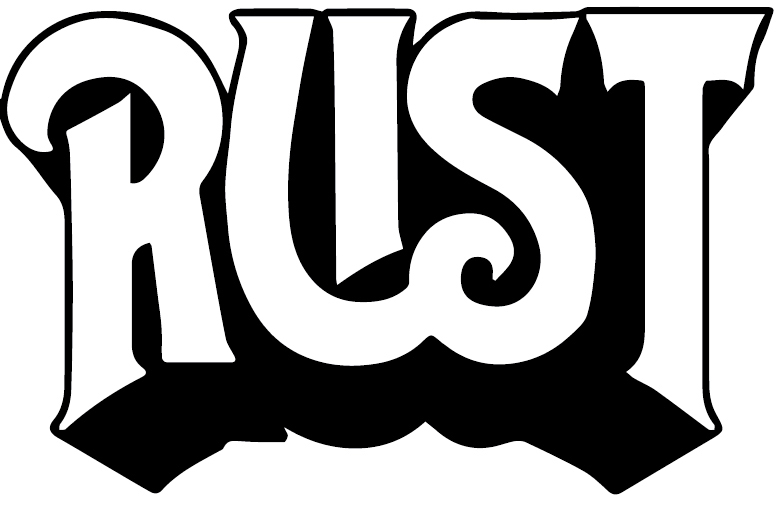

# Command-Line Rust: A Project-Based Primer for Writing Rust CLIs

This is the code repository for the O'Reilly book [_Command-Line Rust_](https://learning.oreilly.com/library/view/command-line-rust/9781098109424/) (ISBN 9781098109417) by Ken Youens-Clark.
The "main" branch has the original source code using version 2.33 of the `clap` crate, which was the latest version while I was writing the book.
The "clap_v4" branch has been updated to use the builder pattern of `clap` version 4 along with clippy suggestions as of Rust 1.67.

For several consecutive years, Rust has been voted "most loved programming language" in Stack Overflow's annual developer survey. This open source systems programming language is now used for everything from game engines and operating systems to browser components and virtual reality simulation engines. But Rust is also an incredibly complex language with a notoriously difficult learning curve.

Rather than focus on the language as a whole, this guide teaches Rust using a single small, complete, focused program in each chapter. Author Ken Youens-Clark shows you how to start, write, and test each of these programs to create a finished product. You'll learn how to handle errors in Rust, read and write files, and use regular expressions, Rust types, structs, and more.

Discover how to:

* Use Rust's standard libraries and data types to create command-line programs
* Write and test Rust programs and functions
* Read and write files, including stdin, stdout, and stderr
* Document and validate command-line arguments
* Write programs that fail gracefully
* Parse raw and delimited text
* Use and control randomness
